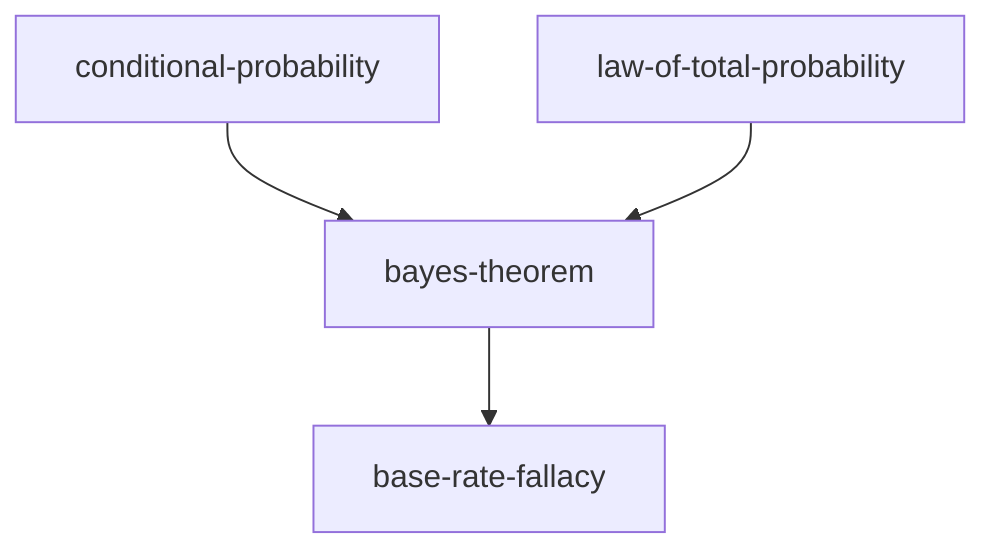
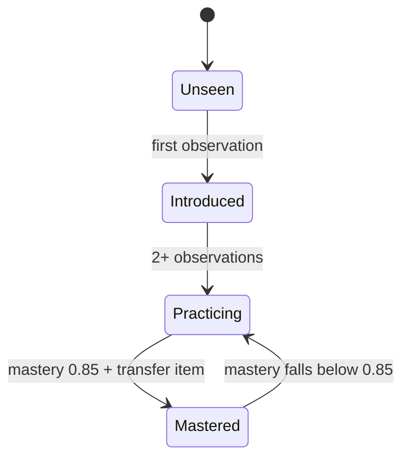

# visualize

The tutor cannot see Obsidian's render, so a diagram that breaks is invisible from the
terminal. These rules exist to make a first attempt render correctly.

**If a diagram does break**, the learner writes `broken` in the answer slot — repair it or
simplify it, and never leave a broken block in the note.

## When a picture earns its place

| The thing being taught | Form |
| --- | --- |
| Structure: how parts relate, a hierarchy, a dependency | **Mermaid** `graph` |
| Process: steps, branches, a state machine, a protocol | **Mermaid** `flowchart`, `stateDiagram-v2`, `sequenceDiagram` |
| Geometry: a construction, a vector, an annotated figure | **Hand-written SVG** |
| The shape of a function, or real data | **matplotlib to a PNG** |
| Anything with two or three items | **A table or a sentence** |

A diagram of three boxes is worse than a sentence. If the picture would only restate what
the prose says, write the prose. The test is whether the *spatial* arrangement carries
information — adjacency, direction, proportion, containment. If it does not, it is
decoration.

## Mermaid

In a fenced `mermaid` block. Obsidian renders it in place and it stays editable text, which
is why it is the default.

````markdown

````

### The mistakes that actually break it

| Mistake | Why it breaks | Do this |
| --- | --- | --- |
| `bayes-theorem --> x` | `-` is read as part of the arrow | Underscores in the node ID, the readable name as a quoted label: `bayes_theorem["bayes-theorem"]` |
| `A[P(A|B)]` | `\|` splits an edge label; `(` opens a shape | Quote the label: `A["P(A|B)"]` |
| `end` as a node ID | Reserved word in flowcharts | `End`, or `e1["end"]` |
| `A[f(x) = x^2]` | Parentheses inside an unquoted label | `A["f(x) = x^2"]` |
| `$\int f$` in a label | Mermaid does not render LaTeX | Plain text in the node; the math goes in the prose around it |
| `A["line1\nline2"]` | `\n` is literal | `A["line1<br/>line2"]` |
| `class A mastered` before `classDef` | The class must be defined first | All `classDef` lines, then all `class` lines |
| `%%{init: {...}}%%` theming | Fragile across versions and themes | Plain `classDef` with explicit `fill`, `stroke` **and** `color` |
| A `classDef` with no `color:` | Dark theme puts dark text on a dark fill | Always set `color:` as well as `fill:` |
| Quotes inside a quoted label | Ends the label early | `#quot;` , or rephrase |

### Size

**About 15 nodes, and never more than 20.** Past that it renders as a grey tangle and
teaches nothing. If the subject needs more:

- draw the part being taught today, and say in a line what sits outside the frame;
- or split it into two diagrams at a natural seam;
- or use `subgraph` to collapse a region into one box.

Generated maps in `Maps/` are the exception — they are reference, not teaching, and
`tutor.py maps` caps them at 40 nodes with the frontier at the centre.

### The types worth knowing



`sequenceDiagram` for protocols and message order. `flowchart LR` when the steps read
left-to-right and the labels are long. `graph TD` for dependency, always top-down, because
a prerequisite above its dependent matches how the learner reads the graph.

## Hand-written SVG

For geometry, vectors, annotated figures — anything where exact position carries the
meaning. Save to `Assets/<dashed-name>.svg` and embed with `![[unit-circle-sine.svg]]`.

```xml
<svg xmlns="http://www.w3.org/2000/svg" viewBox="0 0 320 200" width="320" height="200"
     role="img" aria-labelledby="t1">
  <title id="t1">The unit circle, with sine as the vertical leg</title>
  <circle cx="100" cy="100" r="70" fill="none" stroke="#8a8f98" stroke-width="1.5"/>
  <line x1="30" y1="100" x2="170" y2="100" stroke="#8a8f98" stroke-width="1"/>
  <line x1="100" y1="30" x2="100" y2="170" stroke="#8a8f98" stroke-width="1"/>
  <line x1="100" y1="100" x2="149" y2="51" stroke="#3a7bd5" stroke-width="2.5"/>
  <line x1="149" y1="100" x2="149" y2="51" stroke="#c9184a" stroke-width="2.5"/>
  <text x="155" y="80" fill="#c9184a" font-size="13" font-family="sans-serif">sin t</text>
</svg>
```

Rules, each of which comes from something that goes wrong otherwise:

- **Always a `viewBox`**, so it scales. `width`/`height` as well, so it does not fill the
  note.
- **Mid-tone colours only.** Pure black strokes vanish in Obsidian's dark theme and pure
  white in its light one. `#8a8f98` for structure, `#3a7bd5` / `#c9184a` / `#2d6a4f` for
  the things being pointed at — all four read on both themes.
- **Never `fill="white"` as a background.** Leave it transparent and let the theme show
  through.
- **No external fonts, no CSS files, no scripts.** `font-family="sans-serif"` only.
- **A `<title>`**, referenced by `aria-labelledby`. It is the alt text, and it forces you to
  say what the figure is for.
- **Label the thing, not the picture.** Text belongs next to what it names, at
  `font-size="12"`–`14"`; smaller is unreadable at note width.
- **Keep it under about 400 × 300** unless the detail genuinely needs more.

## Plots from data or functions

Only if matplotlib is installed. Check first, and silently fall back to a Mermaid sketch or
a table of values if it is not:

```bash
python3 -c "import matplotlib" 2>/dev/null && echo yes || echo no
```

Then write a small script into the learner's workspace — not into the engine repo — run it,
and embed the result:

```bash
python3 "Workspaces/<topic>/<date>-plot.py"     # writes Assets/<name>.png
```

```python
import matplotlib
matplotlib.use("Agg")                  # no display in a terminal session
import matplotlib.pyplot as plt
import numpy as np

x = np.linspace(-3, 3, 400)
fig, ax = plt.subplots(figsize=(5, 3), dpi=160)
ax.plot(x, np.exp(-x**2 / 2) / np.sqrt(2 * np.pi), color="#3a7bd5")
ax.set_xlabel("x"); ax.set_ylabel("density")
ax.spines[["top", "right"]].set_visible(False)
fig.tight_layout()
fig.savefig("Assets/standard-normal-density.png", transparent=True)
```

`transparent=True` matters for the same reason as the SVG rule: an opaque white panel looks
broken in a dark vault. Embed with `![[standard-normal-density.png]]`.

The plot script is the learner's file. If the plot *is* the exercise, write the stub and let
them fill in the function — a plot they produced teaches more than one they were shown.

## In a lesson

- Put the diagram **after** the prediction question and **before** the explanation, so they
  have already committed to a guess.
- A diagram can be the item: "here is the state machine with one transition missing — which,
  and why?" is a better item than any question about a complete one.
- Having the learner draw it is better still. Ask for Mermaid in their answer slot; grade
  the structure, never the syntax, and fix the syntax silently.
